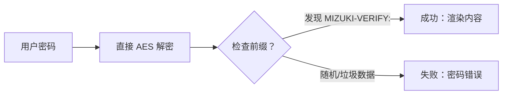

该博客模板基于 [Astro](https://astro.build/) 构建。指南未提及的内容可在 [Astro 文档](https://docs.astro.build/) 中找到答案。

## 文章 Frontmatter

```yaml
---
title: 我的第一篇博客文章
published: 2023-09-09
description: 这是我新的 Astro 博客的第一篇文章。
image: ./cover.jpg
tags: [示例, 演示]
category: 前端
draft: true
---
```


| 字段     | 说明                                                                                                                                                                                                 |
|---------------|-------------------------------------------------------------------------------------------------------------------------------------------------------------------------------------------------------------|
| `title`       | 文章标题。                                                                                                                                                                                      |
| `published`   | 文章发布时间。                                                                                                                                                                            |
| `pinned`      | 是否置顶到文章列表顶部。                                                                                                                                                   |
| `description` | 文章的简短描述，展示在索引页。                                                                                                                                                   |
| `image`       | 文章封面图路径。<br/>1. 以 `http://` 或 `https://` 开头：使用网络图片<br/>2. 以 `/` 开头：图片在 `public` 目录<br/>3. 无前缀：相对当前 Markdown 文件 |
| `tags`        | 文章标签。                                                                                                                                                                                       |
| `category`    | 文章分类。                                                                                                                                                                                   |
| `alias`   | 文章别名。文章可通过 `/posts/{alias}/` 访问，例如：`my-special-article`（访问 `/posts/my-special-article/`）                                   |
| `licenseName` | 文章内容的许可证名称。                                                                                                                                                                      |
| `author`      | 文章作者。                                                                                                                                                                                     |
| `sourceLink`  | 文章内容的来源链接或参考。                                                                                                                                                          |
| `draft`       | 若文章仍为草稿，则不会显示。                                                                                                                                                    |

## 文章文件放在哪里


文章文件应放在 `src/content/posts/` 目录中。你也可以创建子目录来更好地组织文章与资源。

```
src/content/posts/
├── post-1.md
└── post-2/
    ├── cover.png
    └── index.md
```

## 文章别名

你可以在 Frontmatter 中添加 `alias` 字段，为文章设置别名：

```yaml
---
title: 我的特别文章
published: 2024-01-15
alias: "my-special-article"
tags: ["示例"]
category: "技术"
---
```

设置别名后：
- 文章可通过自定义 URL 访问（如 `/posts/my-special-article/`）
- 默认的 `/posts/{slug}/` URL 仍可使用
- RSS/Atom 订阅会使用自定义别名
- 站内链接会自动使用自定义别名

**重要说明：**
- 别名不要包含 `/posts/` 前缀（系统会自动添加）
- 别名避免使用特殊字符与空格
- 建议使用小写字母与连字符，利于 SEO
- 确保别名在所有文章中唯一
- 不要包含首尾斜杠


## 工作原理


